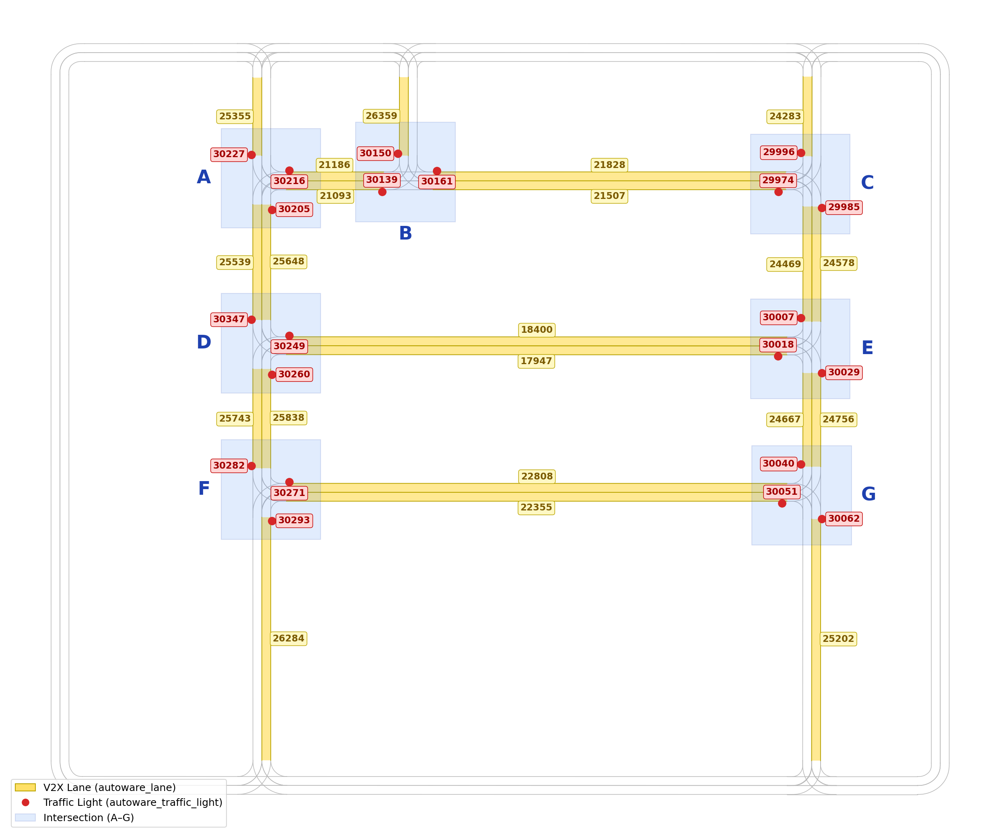

V2X in Carla
============

V2X module integrated the autonomous system between multiple vehicles and the traffic light manager.

.. image:: https://img.youtube.com/vi/8R8hPGfjEwk/0.jpg
    :alt: Zenoh-based V2X with Autoware and Carla
    :target: https://youtu.be/8R8hPGfjEwk

Map Info
--------

``map_info.json`` describes the traffic lights at each intersection used by the V2X module. The structure is:

.. code-block:: json

   {
     "intersections": {
       "<intersection_id>": [
         {
           "autoware_lane": <int>,
           "autoware_traffic_light": <int>,
           "traffic_light_position": { "x": <float>, "y": <float> }
         }
       ]
     }
   }

Field meanings:

* ``intersection_id`` — intersection label.
* ``autoware_lane`` — Lane ID.
* ``autoware_traffic_light`` — Traffic Light ID.
* ``traffic_light_position`` — ``(x, y)`` in the Autoware map frame.

Build V2X module
----------------

* Enter into docker

..  code-block:: bash

    ./container/run-autoware-docker.sh

* Build the code

.. code-block:: bash

   cd autoware_carla_launch/external/zenoh_autoware_v2x
   colcon build --symlink-install

Running single vehicle scenario
-------------------------------

**Step 1:** Running CARLA simulator

.. code-block:: bash

   ./CarlaUE4.sh -quality-level=Epic -world-port=2000 -RenderOffScreen -prefernvidia

**Step 2:** Run the zenoh_carla_bridge with V2X component (In Carla bridge container)

.. code-block:: bash

   # Go inside "Carla bridge container"
   ./container/run-bridge-docker.sh
   # Run zenoh_carla_bridge and Python Agent with V2X component
   cd autoware_carla_launch
   source env.sh
   # Option A: rmw_zenoh
   ./script/bridge_rmw_zenoh/run-bridge-v2x-with-rmw_zenoh.sh
   # Option B: ros2dds
   ./script/bridge_ros2dds/run-bridge-v2x.sh

.. note::
   You can determine whether the bridge is running properly and verify that the V2X component is successfully retrieving the required information from the Carla simulator by checking if the terminal displays the following output...

.. code-block:: bash

   INFO  zenoh_carla_bridge > Running Carla Autoware Zenoh bridge...
   ...
   INFO: [Traffic Manager] Declaring Subscriber on 'vehicle/pose/**'...
   ...
   INFO: [Intersection Manager] Declaring Queryable on 'intersection/**/traffic_light/**'...
   ...

**Step 3:** Run Autoware with the V2X light client (In Autoware container)

.. code-block:: bash

   # Go inside "Autoware container"
   ./container/run-autoware-docker.sh
   # Run Autoware and the V2X light client in one shot
   cd autoware_carla_launch
   source env.sh
   # Option A: rmw_zenoh
   # Format: ./script/autoware_rmw_zenoh/run-autoware-v2x-with-rmw_zenoh.sh <vehicle_id>
   ./script/autoware_rmw_zenoh/run-autoware-v2x-with-rmw_zenoh.sh
   # Option B: ros2dds
   # Format: ./script/autoware_ros2dds/run-autoware-v2x.sh <vehicle_id>
   ./script/autoware_ros2dds/run-autoware-v2x.sh

.. note::
   <vehicle_id> must **match** CARLA agent's rolename. (default is **"v1"**)

**Step 4:** Wait for Autoware to localize the vehicle, then set the 2D Goal Pose.

**Step 5:** Press the **"Auto"** button in **Rviz** and let Autoware autopilot the vehicle.

Running multiple vehicles scenario
----------------------------------

**Step 1:** Running CARLA simulator

**Step 2:** Entering bridge container then executing...

.. code-block:: bash

   cd autoware_carla_launch
   source env.sh
   # Option A: rmw_zenoh
   ./script/bridge_rmw_zenoh/run-bridge-two-vehicles-v2x-with-rmw_zenoh.sh
   # Option B: ros2dds
   ./script/bridge_ros2dds/run-bridge-two-vehicles-v2x.sh

**Step 3:** Running Autoware container for 1st vehicle...

.. code-block:: bash

   cd autoware_carla_launch
   source env.sh
   # Option A: rmw_zenoh
   ./script/autoware_rmw_zenoh/run-autoware-v2x-with-rmw_zenoh.sh v1
   # Option B: ros2dds
   ./script/autoware_ros2dds/run-autoware-v2x.sh v1

**Step 4:** Running another Autoware container for 2nd vehicle...

.. code-block:: bash

   cd autoware_carla_launch
   source env.sh
   # Option A: rmw_zenoh
   ./script/autoware_rmw_zenoh/run-autoware-v2x-with-rmw_zenoh.sh v2
   # Option B: ros2dds
   ./script/autoware_ros2dds/run-autoware-v2x.sh v2

**Step 5:** Wait for Autoware to localize two vehicles, and then both set the 2D Goal Pose.

**Step 6:** Press the "Auto" button in Rviz and let two Autoware autopilot the vehicles
